<h1>Web map tools WCAG 2.1 evaluation</h1>

A summary of this evaluation was presented ([video](https://www.youtube.com/watch?v=V-Gx0e5Gkzg)/[slides](https://wcag-maps.nicchan.me/)) by [Nic Chan](https://www.nicchan.me/) at the 2020 [W3C/OGC Joint Workshop Series on Maps for the Web](https://www.w3.org/2020/maps/).

<h2>Evaluation scope</h2>

  This <a href="https://www.w3.org/TR/WCAG21/">WCAG 2.1</a> evaluation is to manually assess the accessibility support of a
  <a href="https://maps4html.org/HTML-Map-Element-UseCases-Requirements/examples/create-map.html">basic web map</a>
  from each of the web map tools as implemented by the W3C
  <a href="https://www.w3.org/community/maps4html/">Maps for HTML Community Group</a>.

  The intention of this document is to get a broad sense for the accessibility support of the evaluated web map tools. The evaluation should not be considered complete, and the results of a given <a href="#evaluated-success-criteria">Success Criterion</a> should not be interpreted as a comparison for accessibility support between the different web map tools.

  
Evaluated web map tools

  <ul>
    <li><a href="https://maps4html.org/HTML-Map-Element-UseCases-Requirements/examples/create-map.html#google-maps-embed">Google Maps embed</a> v3</li>
    <li><a href="https://maps4html.org/HTML-Map-Element-UseCases-Requirements/examples/create-map.html#google-maps-api">Google Maps Platform API</a> v3.40</li>
    <li><a href="https://maps4html.org/HTML-Map-Element-UseCases-Requirements/examples/create-map.html#bing-maps-embed">Bing Maps embed</a> v8</li>
    <li><a href="https://maps4html.org/HTML-Map-Element-UseCases-Requirements/examples/create-map.html#bing-maps-api">Bing Maps Control API</a> v8</li>
    <li><a href="https://maps4html.org/HTML-Map-Element-UseCases-Requirements/examples/create-map.html#mapkit-js">MapKit JS (Apple Maps) API</a> v5.40.0</li>
    <li><a href="https://maps4html.org/HTML-Map-Element-UseCases-Requirements/examples/create-map.html#leaflet-js">Leaflet JS API</a> v1.5.1</li>
    <li><a href="https://maps4html.org/HTML-Map-Element-UseCases-Requirements/examples/create-map.html#openstreetmap">OpenStreetMap embed</a> v0.7.55.7</li>
    <li><a href="https://maps4html.org/HTML-Map-Element-UseCases-Requirements/examples/create-map.html#openlayers">OpenLayers API</a> v5.3.0</li>
    <li><a href="https://maps4html.org/HTML-Map-Element-UseCases-Requirements/examples/create-map.html#mapbox-embed">MapBox Studio embed</a> v1.0.0</li>
    <li><a href="https://maps4html.org/HTML-Map-Element-UseCases-Requirements/examples/create-map.html#mapbox-api">MapBox GL JS API</a> v4.4.1</li>
    <li><a href="https://maps4html.org/HTML-Map-Element-UseCases-Requirements/examples/create-map.html#tomtom">TomTom Maps SDK for Web</a> v4.47.6</li>
  </ul>

  
Environment and tools used in the evaluation

  <ul>
    <li>Windows 10</li>
    <li><a href="https://www.google.com/chrome/">Chrome browser</a> and dev tools v81.0.4044.122</li>
    <li><a href="https://chrome.google.com/webstore/detail/chromevox-classic-extensi/kgejglhpjiefppelpmljglcjbhoiplfn">ChromeVox Classic Extension</a> v53.0.2784.6</li>
    <li><a href="https://www.nvaccess.org/">NVDA</a> v2019.3.1</li>
    <li>
      <a href="https://accessibilityinsights.io/docs/en/web/overview">Accessibility Insights for Web</a>'s Visual Helper 
      (<a href="https://chrome.google.com/webstore/detail/accessibility-insights-fo/pbjjkligggfmakdaogkfomddhfmpjeni">Chrome extension</a> v2.14.1)
    </li>
  </ul>

<h2>Evaluated Success Criteria</h2>

  
Jump to Success Criterion

  <h3>Perceivable</h3>
  <ul>
    <li><a href="#111-non-text-content-level-a">1.1.1 Non-text Content (Level A)</a></li>
    <li><a href="#131-info-and-relationships-level-a">1.3.1 Info and Relationships (Level A)</a></li>
    <li><a href="#143-contrast-minimum-level-aa">1.4.3 Contrast (Minimum) (Level AA)</a></li>
  </ul>
  <h3>Operable</h3>
  <ul>
    <li><a href="#211-keyboard-level-a">2.1.1 Keyboard (Level A)</a></li>
    <li><a href="#212-no-keyboard-trap-level-a">2.1.2 No Keyboard Trap (Level A)</a></li>
    <li><a href="#214-character-key-shortcuts-level-a">2.1.4 Character Key Shortcuts (Level A)</a></li>
    <li><a href="#243-focus-order-level-a">2.4.3 Focus Order (Level A)</a></li>
    <li><a href="#247-focus-visible-level-aa">2.4.7 Focus Visible (Level AA)</a></li>
    <li><a href="#255-target-size-level-aaa">2.5.5 Target Size (Level AAA)</a></li>
  </ul>
  <h3>Understandable</h3>
  <ul>
    <li><a href="#311-language-of-page-level-a">3.1.1 Language of Page (Level A)</a></li>
    <li><a href="#312-language-of-parts-level-aa">3.1.2 Language of Parts (Level AA)</a></li>
    <li><a href="#322-on-input-level-a">3.2.2 On Input (Level A)</a></li>
    <li><a href="#325-change-on-request-level-aaa">3.2.5 Change on Request (Level AAA)</a></li>
  </ul>
  <h3>Robust</h3>
  <ul>
    <li><a href="#412-name-role-value-level-a">4.1.2 Name, Role, Value (Level A)</a></li>
  </ul>

<h3><a href="https://www.w3.org/TR/WCAG21/#non-text-content">1.1.1 Non-text Content</a> (Level A)</h3>

<h4>Assessment</h4>

<ol>
  <li>Identify all <a href="https://www.w3.org/TR/WCAG21/#dfn-non-text-content">non-text content</a>.</li>
  <li>
    If non-text content is <a href="https://www.w3.org/TR/WCAG21/#dfn-pure-decoration">pure decoration</a>, is used only for visual formatting, or is not presented to users, then it is implemented in a way that it can be ignored by
    assistive technology (AT), (e.g. using <code>aria-hidden="true"</code>).
  </li>
  <li>If the <i>non-text content</i> is not intended as <i>pure decoration</i>, it has a <a href="https://www.w3.org/TR/WCAG21/#dfn-text-alternative">text alternative</a>.</li>
  <li>If <i>non-text content</i> is a control or input, refer to the assessment of <a href="#412-name-role-value-level-a">SC 4.1.2 Name, Role, Value</a> for additional requirements.</li>
</ol>

If the requirements of step #2 and #3 are met <i>Result</i> is <i>Pass</i>, else <i>Fail</i>.

<table>
  <thead>
    <tr>
      <th scope="col">Web map tool</th>
      <th scope="col">Result</th>
      <th scope="col">Notes</th>
    </tr>
  </thead>
  <tbody>
    <tr>
      <th scope="row" align="left">Google Maps embed</th>
      <td>Fail</td>
      <td>
        The image depicting "Google" (logo) is neither hidden from <abbr>ATs</abbr> nor has a <i>text alternative</i>.
      </td>
    </tr>
    <tr>
      <th scope="row" align="left">Google Maps Platform API</th>
      <td>Fail</td>
      <td>
        The link that opens a new window to view the current location (in "Street view") is visually presented as an icon, but is missing a <i>text alternative</i>.
      </td>
    </tr>
    <tr>
      <th scope="row" align="left">Bing Maps embed</th>
      <td>Pass</td>
      <td></td>
    </tr>
    <tr>
      <th scope="row" align="left">Bing Maps Control API</th>
      <td>Pass</td>
      <td></td>
    </tr>
    <tr>
      <th scope="row" align="left">MapKit JS (Apple Maps) API</th>
      <td>Fail</td>
      <td>The control to change/reset the bearing has a child node with the text character "N" to convey "North", it is presumably <i>decorative</i> but is not hidden from ATs.</td>
    </tr>
    <tr>
      <th scope="row" align="left">Leaflet JS API</th>
      <td>Pass</td>
      <td></td>
    </tr>
    <tr>
      <th scope="row" align="left">OpenStreetMap embed</th>
      <td>Pass</td>
      <td></td>
    </tr>
    <tr>
      <th scope="row" align="left">OpenLayers API</th>
      <td>Fail</td>
      <td>Characters "+" and "−" of the zoom controls are <i>decorative</i> but are not hidden from ATs. [<a href="https://github.com/openlayers/openlayers/issues/12041">Github issue</a>]</td>
    </tr>
    <tr>
      <th scope="row" align="left">MapBox Studio embed</th>
      <td>Pass</td>
      <td></td>
    </tr>
    <tr>
      <th scope="row" align="left">MapBox GL JS API</th>
      <td>Pass</td>
      <td></td>
    </tr>
    <tr>
      <th scope="row" align="left">TomTom Maps SDK for Web</th>
      <td>Fail</td>
      <td>Character "×" of the control to close the copyright message dialog is <i>decorative</i> but is not hidden from ATs.</td>
    </tr>
  </tbody>
</table>

<h3><a href="https://www.w3.org/TR/WCAG21/#info-and-relationships">1.3.1 Info and Relationships</a> (Level A)</h3>

<h4>Assessment</h4>
<ol>
  <li>
    Verify that information (such as a control's <a href="https://www.w3.org/TR/wai-aria-1.1/#dfn-state">state</a>), <a href="https://www.w3.org/TR/WCAG21/#dfn-structure">structure</a>, and
    <a href="https://www.w3.org/TR/WCAG21/#dfn-relationships">relationships</a> conveyed through <a href="https://www.w3.org/TR/WCAG21/#dfn-presentation">presentation</a> can be
    <a href="https://www.w3.org/TR/WCAG21/#dfn-programmatically-determinable">programmatically determined</a> or are available in text.
  </li>
</ol>

If requirements of step #1 is met <i>Result</i> is <i>Pass</i>, else <i>Fail</i>.

<table>
  <thead>
    <tr>
      <th scope="col">Web map tool</th>
      <th scope="col">Result</th>
      <th scope="col">Notes</th>
    </tr>
  </thead>
  <tbody>
    <tr>
      <th scope="row" align="left">Google Maps embed</th>
      <td>Fail</td>
      <td>The zoom controls' <a href="https://www.w3.org/TR/wai-aria/#aria-disabled">disabled</a> <i>state</i> cannot be programmatically determined.</td>
    </tr>
    <tr>
      <th scope="row" align="left">Google Maps Platform API</th>
      <td>Fail</td>
      <td>
        <ul>
          <li>The web map's semantic <i>structure</i> as a distinct piece of content cannot be programmatically determined.</li>
          <li>The zoom controls' <a href="https://www.w3.org/TR/wai-aria/#aria-disabled">disabled</a> <i>state</i> cannot be programmatically determined.</li>
          <li>The fullscreen control's <a href="https://www.w3.org/TR/wai-aria/#aria-pressed">pressed</a> <i>state</i> cannot be programmatically determined.</li>
        </ul>
      </td>
    </tr>
    <tr>
      <th scope="row" align="left">Bing Maps embed</th>
      <td>Fail</td>
      <td>Scale bars/rulers are missing contextual information (alternatively should be hidden from ATs).</td>
    </tr>
    <tr>
      <th scope="row" align="left">Bing Maps Control API</th>
      <td>Fail</td>
      <td>
        <ul>
          <li>The web map's semantic <i>structure</i> as a distinct piece of content cannot be programmatically determined.</li>
          <li>Scale bars/rulers are missing contextual information (alternatively should be hidden from ATs).</li>
          <li>The "Reset orientation" control's <a href="https://www.w3.org/TR/wai-aria/#aria-disabled">disabled</a> <i>state</i> cannot be programmatically determined.</li>
          <li>The "Locate me" control's <a href="https://www.w3.org/TR/wai-aria/#aria-pressed">pressed</a> <i>state</i> cannot be programmatically determined.</li>
        </ul>
      </td>
    </tr>
    <tr>
      <th scope="row" align="left">MapKit JS (Apple Maps) API</th>
      <td>Fail</td>
      <td>
        The web map's semantic <i>structure</i> as a distinct piece of content cannot be programmatically determined.
      </td>
    </tr>
    <tr>
      <th scope="row" align="left">Leaflet JS API</th>
      <td>Fail</td>
      <td>
        <ul>
          <li>The web map's semantic <i>structure</i> as a distinct piece of content cannot be programmatically determined. [<a href="https://github.com/Leaflet/Leaflet/issues/7193">Github issue</a>]</li>
          <li>The zoom controls' <a href="https://www.w3.org/TR/wai-aria/#aria-disabled">disabled</a> <i>state</i> cannot be programmatically determined. [<a href="https://github.com/Leaflet/Leaflet/issues/7211">Github issue</a>]</li>
        </ul>
      </td>
    </tr>
    <tr>
      <th scope="row" align="left">OpenStreetMap embed</th>
      <td>Fail</td>
      <td>The zoom controls' <a href="https://www.w3.org/TR/wai-aria/#aria-disabled">disabled</a> <i>state</i> cannot be programmatically determined.</td>
    </tr>
    <tr>
      <th scope="row" align="left">OpenLayers API</th>
      <td>Fail</td>
      <td>
        <ul>
          <li>The web map's semantic <i>structure</i> as a distinct piece of content cannot be programmatically determined. [<a href="https://github.com/openlayers/openlayers/issues/12314">Github issue</a>]</li>
          <li>The zoom controls' <a href="https://www.w3.org/TR/wai-aria/#aria-disabled">disabled</a> <i>state</i> cannot be programmatically determined. [<a href="https://github.com/openlayers/openlayers/issues/12316">Github issue</a>]</li>
        </ul>
      </td>
    </tr>
    <tr>
      <th scope="row" align="left">MapBox Studio embed</th>
      <td>Fail</td>
      <td>The "Zoom out" control's <a href="https://www.w3.org/TR/wai-aria/#aria-disabled">disabled</a> <i>state</i> cannot be programmatically determined. [<a href="https://github.com/mapbox/mapbox-gl-js/pull/9991">Github PR</a>]</td>
    </tr>
    <tr>
      <th scope="row" align="left">MapBox GL JS API</th>
      <td>Fail</td>
      <td>The web map's semantic <i>structure</i> as a distinct piece of content cannot be programmatically determined.</td>
    </tr>
    <tr>
      <th scope="row" align="left">TomTom Maps SDK for Web</th>
      <td>Fail</td>
      <td>
        <ul>
          <li>The web map's semantic <i>structure</i> as a distinct piece of content cannot be programmatically determined.</li>
          <li>The zoom controls' <a href="https://www.w3.org/TR/wai-aria/#aria-disabled">disabled</a> <i>state</i> cannot be programmatically determined.</li>
        </ul>
      </td>
    </tr>
  </tbody>
</table>

<h3><a href="https://www.w3.org/TR/WCAG21/#contrast-minimum">1.4.3 Contrast (Minimum)</a> (Level AA)</h3>

<h4>Assessment</h4>
<ol>
  <li>
    Verify that the visual presentation of <a href="https://www.w3.org/TR/WCAG21/#dfn-text">text</a> and <a href="https://www.w3.org/TR/WCAG21/#dfn-images-of-text">images of text</a> has a <a href="https://www.w3.org/TR/WCAG21/#dfn-contrast-ratio">contrast ratio</a> of at least 4.5:1, except for the following:
    <ul>
      <li>Large Text: <a href="https://www.w3.org/TR/WCAG21/#dfn-large-scale">Large-scale</a> text and images of large-scale text have a contrast ratio of at least 3:1;</li>
      <li>Incidental: Text or images of text that are part of an inactive <a href="https://www.w3.org/TR/WCAG21/#dfn-user-interface-components">user interface component</a>, that are <a href="https://www.w3.org/TR/WCAG21/#dfn-pure-decoration">pure decoration</a>, that are not visible to anyone, or that are part of a picture that contains significant other visual content, have no contrast requirement;</li>
      <li>Logotypes: Text that is part of a logo or brand name has no contrast requirement.</li>
    </ul>
  </li>
</ol>

If requirements of check #1 is met <i>Result</i> is <i>Pass</i>, else <i>Fail</i>.

<table>
  <thead>
    <tr>
      <th scope="col">Web map tool</th>
      <th scope="col">Result</th>
      <th scope="col">Notes</th>
    </tr>
  </thead>
  <tbody>
    <tr>
      <th scope="row" align="left">Google Maps embed</th>
      <td>Fail</td>
      <td>
        The "View larger map" link has a contrast ratio of 3.79. Some map text (i.e. ocean labels) do not mean the minimum contrast ratio.
      </td>
    </tr>
    <tr>
      <th scope="row" align="left">Google Maps Platform API</th>
      <td>Fail</td>
      <td>
        The "View larger map" link has a contrast ratio of 3.79. Some map text (i.e. ocean labels) do not mean the minimum contrast ratio.
      </td>
    </tr>
    <tr>
      <th scope="row" align="left">Bing Maps embed</th>
      <td>Fail</td>
      <td>
        Some map labels (i.e. bodies of water, district labels) do not meet the minimum contrast ratio.
      </td>
    </tr>
    <tr>
      <th scope="row" align="left">Bing Maps Control API</th>
      <td>Fail</td>
      <td>
        Some map labels (i.e. bodies of water, district labels) do not meet the minimum contrast ratio.
      </td>
    </tr>
    <tr>
      <th scope="row" align="left">MapKit JS (Apple Maps) API</th>
      <td>Fail</td>
      <td>
        Some map labels (i.e. bodies of water, minor street labels) do not meet the minimum contrast ratio.
      </td>
    </tr>
    <tr>
      <th scope="row" align="left">Leaflet JS API</th>
      <td>Fail</td>
      <td>
        Some map labels (i.e. regional/districts) do not meet the minimum contrast ratio (uses OpenStreetMap tiles).
      </td>
    </tr>
    <tr>
      <th scope="row" align="left">OpenStreetMap embed</th>
      <td>Fail</td>
      <td>
        Some map labels (i.e. regional/districts) do not meet the minimum contrast ratio (uses OpenStreetMap tiles).
      </td>
    </tr>
    <tr>
      <th scope="row" align="left">OpenLayers API</th>
      <td>Fail</td>
      <td>
        Some map labels (i.e. regional/districts) do not meet the minimum contrast ratio (uses OpenStreetMap tiles).
      </td>
    </tr>
    <tr>
      <th scope="row" align="left">MapBox Studio embed</th>
      <td>Pass</td>
      <td></td>
    </tr>
    <tr>
      <th scope="row" align="left">MapBox GL JS API</th>
      <td>Pass</td>
      <td></td>
    </tr>
    <tr>
      <th scope="row" align="left">TomTom Maps SDK for Web</th>
      <td>Fail</td>
      <td>
        Some map labels (i.e. buildings) do not meet the minimum contrast ratio.
      </td>
    </tr>
  </tbody>
</table>

<h3><a href="https://www.w3.org/TR/WCAG21/#keyboard">2.1.1 Keyboard</a> (Level A)</h3>

<h4>Assessment</h4>

<ol>
  <li>Identify all functionality of the web map.</li>
  <li>Ensure all functionality can be accessed using only a keyboard.</li>
</ol>

If the requirements of step #2 is met <i>Result</i> is <i>Pass</i>, else <i>Fail</i>.

<table>
  <thead>
    <tr>
      <th scope="col">Web map tool</th>
      <th scope="col">Result</th>
      <th scope="col">Notes</th>
    </tr>
  </thead>
  <tbody>
    <tr>
      <th scope="row" align="left">Google Maps embed</th>
      <td>Fail</td>
      <td>
        <ul>
          <li>Map display is not pannable using a keyboard.</li>
          <li>Control to toggle between "Satellite imagery" and "Street map" is not keyboard operable.</li>
        </ul>
      </td>
    </tr>
    <tr>
      <th scope="row" align="left">Google Maps Platform API</th>
      <td>Fail</td>
      <td>
        <ul>
          <li>Control to initiate "Street view" (so called "Pegman") is only draggable using a mouse, and not keyboard operable.</li>
          <li>
            The "Labels" toggle is only accessible in a drop-down after hovering a mouse pointer over the "Satellite" button.
          </li>
          <li>
            The "Terrain" toggle is only accessible in a drop-down after hovering a mouse pointer over the "Map" button.
          </li>
          <li>Control to exit "Street view" (<code>&lt;div jsaction="closeControl.click"&gt;</code>) is not keyboard operable.</li>
        </ul>
      </td>
    </tr>
    <tr>
      <th scope="row" align="left">Bing Maps embed</th>
      <td>Pass</td>
      <td></td>
    </tr>
    <tr>
      <th scope="row" align="left">Bing Maps Control API</th>
      <td>Fail</td>
      <td>Control to toggle area labels under "Bird's Eye view" is not keyboard accessible (has <code>tabindex="-1"</code>).</td>
    </tr>
    <tr>
      <th scope="row" align="left">MapKit JS (Apple Maps) API</th>
      <td>Fail</td>
      <td>Map display is not pannable using a keyboard.</td>
    </tr>
    <tr>
      <th scope="row" align="left">Leaflet JS API</th>
      <td>Pass</td>
      <td></td>
    </tr>
    <tr>
      <th scope="row" align="left">OpenStreetMap embed</th>
      <td>Pass</td>
      <td></td>
    </tr>
    <tr>
      <th scope="row" align="left">OpenLayers API</th>
      <td>Pass</td>
      <td></td>
    </tr>
    <tr>
      <th scope="row" align="left">MapBox Studio embed</th>
      <td>Fail</td>
      <td>
        Control to display attribution and feedback links is not keyboard accessible. [<a href="https://github.com/mapbox/mapbox-gl-js/pull/9991">Github PR</a>]
      </td>
    </tr>
    <tr>
      <th scope="row" align="left">MapBox GL JS API</th>
      <td>Fail</td>
      <td>Control to display attribution and feedback links is not keyboard accessible. [<a href="https://github.com/mapbox/mapbox-gl-js/pull/9991">Github PR</a>]</td>
    </tr>
    <tr>
      <th scope="row" align="left">TomTom Maps SDK for Web</th>
      <td>Fail</td>
      <td>
        <ul>
          <li>Control to open the copyright message dialog is not keyboard accessible.</li>
          <li>Control to close the copyright message dialog is not keyboard accessible.</li>
        </ul>
      </td>
    </tr>
  </tbody>
</table>

<h3><a href="https://www.w3.org/TR/WCAG21/#no-keyboard-trap">2.1.2 No Keyboard Trap</a> (Level A)</h3>

<h4>Assessment</h4>

<ol>
  <li><a href="https://www.w3.org/TR/WCAG21/#dfn-navigated-sequentially">Sequentially navigate</a> components using the <kbd>tab</kbd> key (and operate all controls).</li>
  <li>Check that it is possible to tab or otherwise navigate away from each component using only the keyboard.</li>
</ol>

If the requirements of step #2 is met <i>Result</i> is <i>Pass</i>, else <i>Fail</i>.

<table>
  <thead>
    <tr>
      <th scope="col">Web map tool</th>
      <th scope="col">Result</th>
      <th scope="col">Notes</th>
    </tr>
  </thead>
  <tbody>
    <tr>
      <th scope="row" align="left">Google Maps embed</th>
      <td>Pass</td>
      <td></td>
    </tr>
    <tr>
      <th scope="row" align="left">Google Maps Platform API</th>
      <td>Pass</td>
      <td></td>
    </tr>
    <tr>
      <th scope="row" align="left">Bing Maps embed</th>
      <td>Pass</td>
      <td></td>
    </tr>
    <tr>
      <th scope="row" align="left">Bing Maps Control API</th>
      <td>Pass</td>
      <td></td>
    </tr>
    <tr>
      <th scope="row" align="left">MapKit JS (Apple Maps) API</th>
      <td>Pass</td>
      <td></td>
    </tr>
    <tr>
      <th scope="row" align="left">Leaflet JS API</th>
      <td>Pass</td>
      <td></td>
    </tr>
    <tr>
      <th scope="row" align="left">OpenStreetMap embed</th>
      <td>Pass</td>
      <td></td>
    </tr>
    <tr>
      <th scope="row" align="left">OpenLayers API</th>
      <td>Pass</td>
      <td></td>
    </tr>
    <tr>
      <th scope="row" align="left">MapBox Studio embed</th>
      <td>Pass</td>
      <td></td>
    </tr>
    <tr>
      <th scope="row" align="left">MapBox GL JS API</th>
      <td>Pass</td>
      <td></td>
    </tr>
    <tr>
      <th scope="row" align="left">TomTom Maps SDK for Web</th>
      <td>Pass</td>
      <td></td>
    </tr>
  </tbody>
</table>

<h3><a href="https://www.w3.org/TR/WCAG21/#character-key-shortcuts">2.1.4 Character Key Shortcuts</a> (Level A)</h3>

<h4>Assessment</h4>

If a keyboard shortcut is implemented in content using only letter (including upper- and lower-case letters), punctuation, number, or symbol characters, then at least one of the following is true:

<ol>
  <li>Turn off: A mechanism is available to turn the shortcut off;</li>
  <li>Remap: A mechanism is available to remap the shortcut to use one or more non-printable keyboard characters (e.g. <kbd>ctrl</kbd>, <kbd>alt</kbd>, etc);</li>
  <li>Active only on focus: The keyboard shortcut for a <a href="https://www.w3.org/TR/WCAG21/#dfn-user-interface-components">user interface component</a> is only active when that component has focus.</li>
</ol>

All the web maps that have shortcuts implemented fail both check #1 and #2.

If the requirements of check #3 is met <i>Result</i> is <i>Pass</i>, else <i>Fail</i>.

<table>
  <thead>
    <tr>
      <th scope="col">Web map tool</th>
      <th scope="col">Result</th>
      <th scope="col">Notes</th>
    </tr>
  </thead>
  <tbody>
    <tr>
      <th scope="row" align="left">Google Maps embed</th>
      <td>N/A</td>
      <td>(No single key shortcuts available.)</td>
    </tr>
    <tr>
      <th scope="row" align="left">Google Maps Platform API</th>
      <td>Pass</td>
      <td></td>
    </tr>
    <tr>
      <th scope="row" align="left">Bing Maps embed</th>
      <td>Pass</td>
      <td></td>
    </tr>
    <tr>
      <th scope="row" align="left">Bing Maps Control API</th>
      <td>Pass</td>
      <td></td>
    </tr>
    <tr>
      <th scope="row" align="left">MapKit JS (Apple Maps) API</th>
      <td>N/A</td>
      <td>(No single key shortcuts available.)</td>
    </tr>
    <tr>
      <th scope="row" align="left">Leaflet JS API</th>
      <td>Pass</td>
      <td></td>
    </tr>
    <tr>
      <th scope="row" align="left">OpenStreetMap embed</th>
      <td>Pass</td>
      <td></td>
    </tr>
    <tr>
      <th scope="row" align="left">OpenLayers API</th>
      <td>Fail</td>
      <td>Both the arrow keys (used to pan the map display) as well as the keyboard shortcuts <kbd>+</kbd> and <kbd>-</kbd> (to zoom) can be activated despite unrelated components having focus.</td>
    </tr>
    <tr>
      <th scope="row" align="left">MapBox Studio embed</th>
      <td>Pass</td>
      <td></td>
    </tr>
    <tr>
      <th scope="row" align="left">MapBox GL JS API</th>
      <td>Pass</td>
      <td></td>
    </tr>
    <tr>
      <th scope="row" align="left" nowrap>TomTom Maps SDK for Web</th>
      <td>Pass</td>
      <td></td>
    </tr>
  </tbody>
</table>

<h3><a href="https://www.w3.org/TR/WCAG21/#focus-order">2.4.3 Focus Order</a> (Level A)</h3>

<h4>Assessment</h4>

<ol>
  <li>Determine the order of interactive elements.</li>
  <li>Determine the logical order of interactive elements.</li>
  <li>Check that the order of the interactive elements is the same as the logical order.</li>
</ol>

If the requirements of step #3 is met <i>Result</i> is <i>Pass</i>, else <i>Fail</i>.

  (Note: This Success Criterion includes "Complementary screen reader output",
  the combination of screen readers/browsers tested is not comprehensive and
  different combinations may have different results. Also note that it appears
  NVDA is announcing some things twice, in most cases this is because a component
  has identical <code>aria-label</code> and <code>title</code> attribute values,
  in which case it is considered a bug to announce them both, see: 
  <a href="https://github.com/nvaccess/nvda/issues/7841">https://github.com/nvaccess/nvda/issues/7841</a>.
  To work around the bug, the web map tool author could use
  <code>&lt;span title="" aria-hidden="true"&gt;</code> as a child element of
  the control instead.)

<table>
  <thead>
    <tr>
      <th scope="col">Web map tool</th>
      <th scope="col">Result</th>
      <th scope="col">Notes</th>
      <th>Screenshot</th>
      <th width="300">Complementary screen reader output</th>
    </tr>
  </thead>
  <tbody>
    <tr>
      <th scope="row" align="left">Google Maps embed</th>
      <td>Fail</td>
      <td></td>
      <td>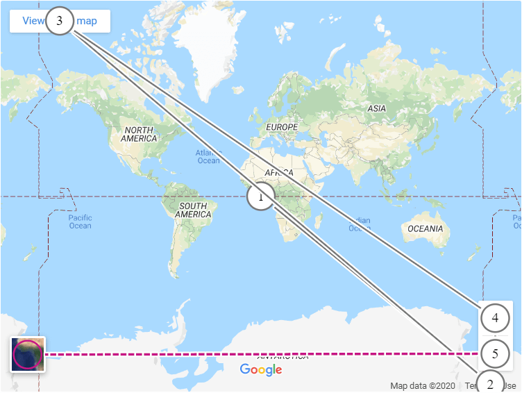</td>
      <td>
        

          
ChromeVox

          <ol>
            <li><i>(no announcement)</i></li>
            <li>"Terms of use <i>link</i>"</li>
            <li>"View larger map <i>link</i>"</li>
            <li>"Zoom in <i>button</i>"</li>
            <li>"Zoom out <i>button</i>"</li>
            <li><i>(no announcement)</i></li>
          </ol>
        

        

          
NVDA

          <ol>
            <li>"Google Maps <i>frame clickable</i>"</li>
            <li>"Terms of use <i>link</i>"</li>
            <li>"<i>clickable</i> View larger map <i>link</i>"</li>
            <li>"Zoom in <i>button</i> Zoom in"</li>
            <li>"Zoom out <i>button</i> Zoom out"</li>
            <li>"<i>clickable</i>"</li>
          </ol>
        

      </td>
    </tr>
    <tr>
      <th scope="row" align="left">Google Maps Platform API</th>
      <td>Fail</td>
      <td></td>
      <td width="350">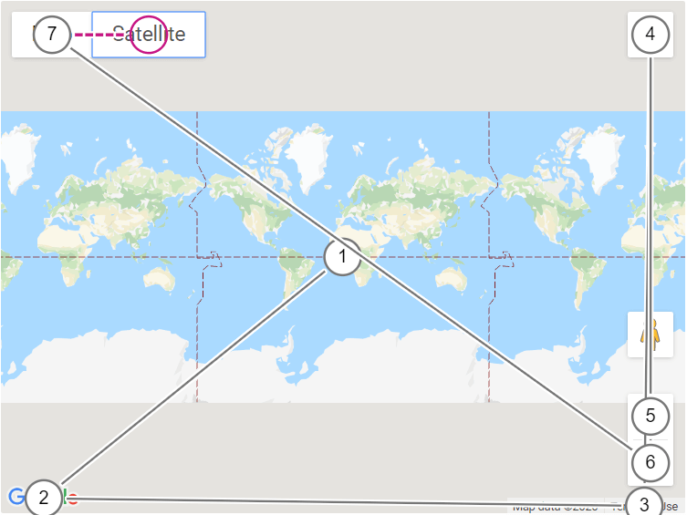</td>
      <td>
        

          
ChromeVox

          <ol>
            <li><i>(no announcement)</i></li>
            <li>"Open this area in Google Maps, opens a new window <i>link</i>"</li>
            <li>"Terms of use <i>link</i>"</li>
            <li>"Toggle fullscreen view <i>button</i>"</li>
            <li>"Zoom in <i>button</i>"</li>
            <li>"Zoom out <i>button</i>"</li>
            <li>"Show street map <i>button pressed</i>"</li>
            <li>"Show satellite imagery <i>button not pressed</i>"</li>
          </ol>
        

        

          
NVDA

          <ol>
            <li>"<i>clickable</i>"</li>
            <li>"Open this area in Google Maps, opens a new window <i>link</i>"</li>
            <li>"Terms of use <i>link</i>"</li>
            <li>"Toggle fullscreen view <i>button</i> toggle fullscreen view"</li>
            <li>"Zoom in <i>button</i> zoom in"</li>
            <li>"Zoom out <i>button</i> zoom out"</li>
            <li>"<i>clickable</i> Show street map <i>toggle button pressed</i> show street map"</li>
            <li>"<i>clickable</i> Show satellite imagery <i>toggle button not pressed</i> show satellite imagery"</li>
          </ol>
        

      </td>
    </tr>
    <tr>
      <th scope="row" align="left">Bing Maps embed</th>
      <td>Pass</td>
      <td></td>
      <td width="350">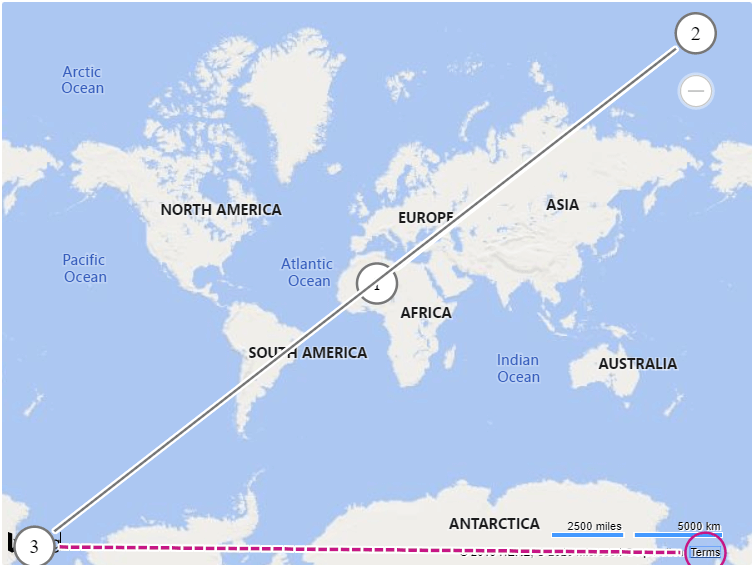</td>
      <td>
        

          
ChromeVox

          <ol>
            <li>"Bing Maps interact to see more"</li>
            <li>"Current level 1 zoom in <i>button</i>"</li>
            <li>"Bing Maps <i>link</i>"</li>
            <li>"Terms <i>link</i>"</li>
          </ol>
        

        

          
NVDA

          <ol>
            <li>"Bing Maps <i>frame clickable</i> Bing Maps interact to see more"</li>
            <li>"Current level 1 zoom in <i>button</i> zoom in"</li>
            <li>"Bing Maps <i>link</i>"</li>
            <li>"Terms <i>link</i> terms"</li>
          </ol>
        

      </td>
    </tr>
    <tr>
      <th scope="row" align="left">Bing Maps Control API</th>
      <td>Pass</td>
      <td></td>
      <td width="350">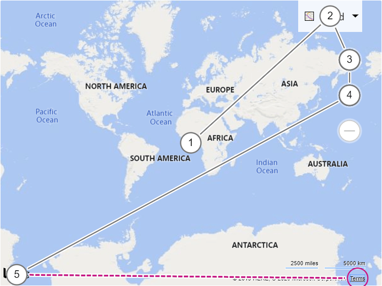</td>
      <td>
        

          
ChromeVox

          <ol>
            <li>"Bing Maps interact to see more"</li>
            <li>"<i>menu collapsed</i>"</li>
            <li>"Locate me <i>button</i>"</li>
            <li>"Current level 1 zoom in <i>button</i>"</li>
            <li>"Bing Maps <i>link</i>"</li>
            <li>"Terms <i>link</i>"</li>
          </ol>
        

        

          
NVDA

          <ol>
            <li>"<i>clickable</i> Bing Maps interact to see more"</li>
            <li>"Current map type: Road, view Aerial, Bird's Eye and more <i>menu</i>"</li>
            <li>"Locate me <i>button</i> locate me"</li>
            <li>"Current level 1 zoom in <i>button</i> zoom in"</li>
            <li>"Bing Maps <i>link</i>"</li>
            <li>"Terms <i>link</i> terms"</li>
          </ol>
        

      </td>
    </tr>
    <tr>
      <th scope="row" align="left">MapKit JS (Apple Maps) API</th>
      <td>Pass</td>
      <td></td>
      <td width="350">
        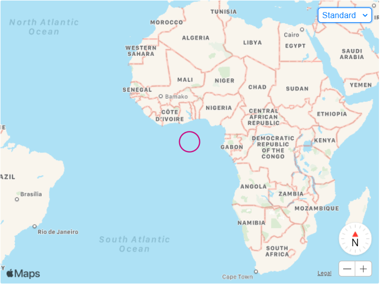
      </td>
      <td>
        

          
ChromeVox

          <ol>
            <li><i>(no announcement)</i></li>
            <li><i>(no announcement)</i></li>
            <li><i>(no announcement)</i></li>
            <li><i>(no announcement)</i></li>
            <li><i>(no announcement)</i></li>
            <li><i>(no announcement)</i></li>
          </ol>
          
(The browser extension cannot read the Shadow DOM because <code>shadowRoot.mode</code> is <code>closed</code>.)

        

        

          
NVDA

          <ol>
            <li>"Change the map type <i>button collapsed</i> change the map type"</li>
            <li>"0 degrees 0 degrees <i>slider</i> N"</li>
            <li>"Zoom in <i>button</i> zoom in"</li>
            <li>"Zoom out <i>button</i> zoom out"</li>
            <li>"Legal <i>button</i>"</li>
          </ol>
        

      </td>
    </tr>
    <tr>
      <th scope="row" align="left">Leaflet JS API</th>
      <td>Pass</td>
      <td></td>
      <td width="350">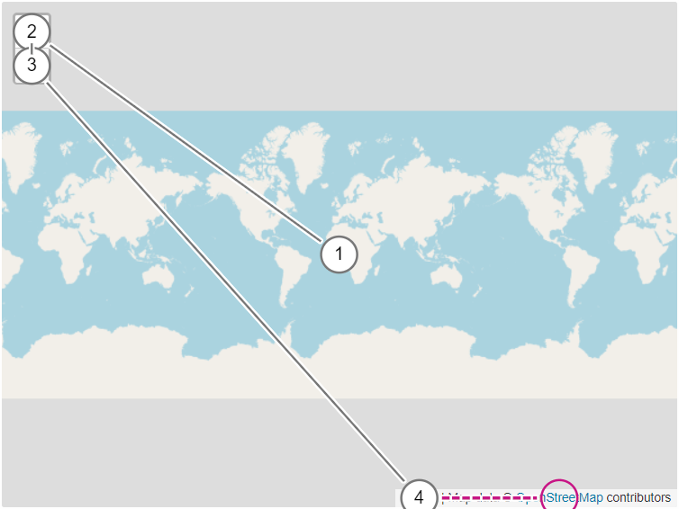</td>
      <td>
        

          
ChromeVox

          <ol>
            <li>"Zoom in zoom out Leaflet map data copyright OpenStreetMap contributors"</li>
            <li>"Zoom in <i>button</i>"</li>
            <li>"Zoom out <i>button</i>"</li>
            <li>"Leaflet <i>link</i>"</li>
            <li>"OpenStreetMap <i>link</i>"</li>
          </ol>
        

        

          
NVDA

          <ol>
            <li>
              "<i>clickable</i> Zoom in zoom out Leaflet map data copyright OpenStreetMap contributors zoom in <i>button</i> zoom in zoom out <i>button</i> Zoom out <i>clickable</i> Leaflet <i>link</i> a JS library for interactive maps map
              data copyright OpenStreetMap <i>link</i> contributors"
            </li>
            <li>"Zoom in <i>button</i> zoom in"</li>
            <li>"Zoom out <i>button</i> zoom out"</li>
            <li>"<i>clickable</i> Leaflet <i>link</i> a JS library for interactive maps"</li>
            <li>"OpenStreetMap <i>link</i>"</li>
          </ol>
        

      </td>
    </tr>
    <tr>
      <th scope="row" align="left">OpenStreetMap embed</th>
      <td>Pass</td>
      <td></td>
      <td width="350">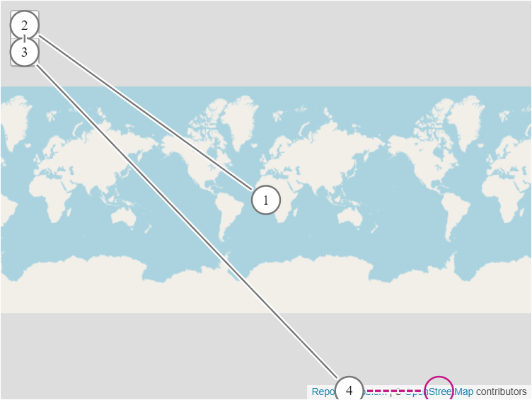</td>
      <td>
        

          
ChromeVox

          <ol>
            <li>"Zoom in zoom out report a problem copyright OpenStreetMap contributors"</li>
            <li>"Zoom in <i>button</i>"</li>
            <li>"Zoom out <i>button</i>"</li>
            <li>"Report a problem"</li>
            <li>"OpenStreetMap"</li>
          </ol>
        

        

          
NVDA

          <ol>
            <li>
              "OpenStreetMap <i>frame clickable</i> zoom in zoom out report a problem copyright OpenStreetMap contributors zoom in <i>button</i> zoom in zoom out <i>button</i> zoom out <i>clickable</i> report a problem <i>link</i> copyright
              OpenStreetMap <i>link</i> contributors"
            </li>
            <li>"Zoom in <i>button</i> zoom in"</li>
            <li>"Zoom out <i>button</i> zoom out"</li>
            <li>"<i>clickable</i> Report a problem <i>link</i>"</li>
            <li>"OpenStreetMap <i>link</i>"</li>
          </ol>
        

      </td>
    </tr>
    <tr>
      <th scope="row" align="left">OpenLayers API</th>
      <td>Pass</td>
      <td></td>
      <td width="350">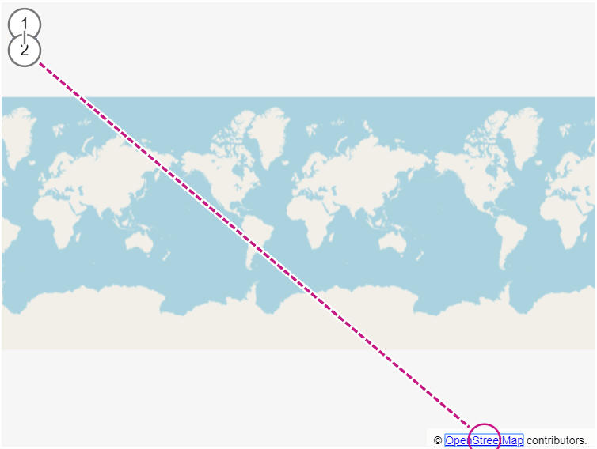</td>
      <td>
        

          
ChromeVox

          <ol>
            <li>"Plus <i>button</i>"</li>
            <li>"Minus <i>button</i>"</li>
            <li>"OpenStreetMap <i>link list item-list with 1 items</i>"</li>
          </ol>
        

        

          
NVDA

          <ol>
            <li>"<i>clickable</i> Plus <i>button</i> zoom in"</li>
            <li>"<i>button</i> Zoom out"</li>
            <li>"<i>list with 1 items</i> OpenStreetMap <i>link</i>"</li>
          </ol>
        

      </td>
    </tr>
    <tr>
      <th scope="row" align="left">MapBox Studio embed</th>
      <td>Pass</td>
      <td></td>
      <td width="350">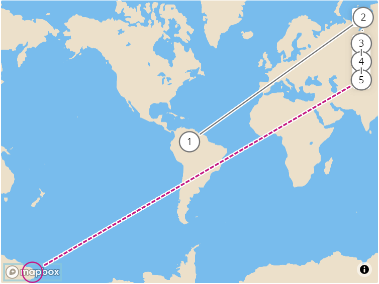</td>
      <td>
        

          
ChromeVox

          <ol>
            <li>"Map"</li>
            <li>"Search <i>edit text</i>"</li>
            <li>"Zoom in <i>button</i>"</li>
            <li>"Zoom out <i>button</i>"</li>
            <li>"Reset bearing to north <i>button</i>"</li>
            <li>"MapBox logo <i>link</i>"</li>
          </ol>
        

        

          
NVDA

          <ol>
            <li>"MapBox Studio <i>frame clickable</i> map <i>graphic</i>"</li>
            <li>"Search <i>edit blank</i>"</li>
            <li>"Zoom in <i>button</i> zoom in"</li>
            <li>"Zoom out <i>button</i> zoom out"</li>
            <li>"Reset bearing to north <i>button</i> reset bearing to north"</li>
            <li>"MapBox logo <i>link</i>"</li>
          </ol>
        

      </td>
    </tr>
    <tr>
      <th scope="row" align="left">MapBox GL JS API</th>
      <td>Pass</td>
      <td></td>
      <td width="350">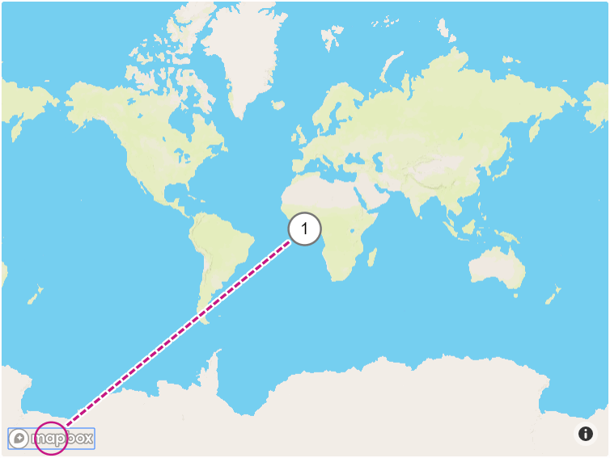</td>
      <td>
        

          
ChromeVox

          <ol>
            <li>"Map"</li>
            <li>"MapBox logo <i>link</i>"</li>
          </ol>
        

        

          
NVDA

          <ol>
            <li>"<i>clickable</i> map <i>graphic</i>"</li>
            <li>"MapBox logo <i>link</i>"</li>
          </ol>
        

      </td>
    </tr>
    <tr>
      <th scope="row" align="left">TomTom Maps SDK for Web</th>
      <td>Pass</td>
      <td></td>
      <td width="350">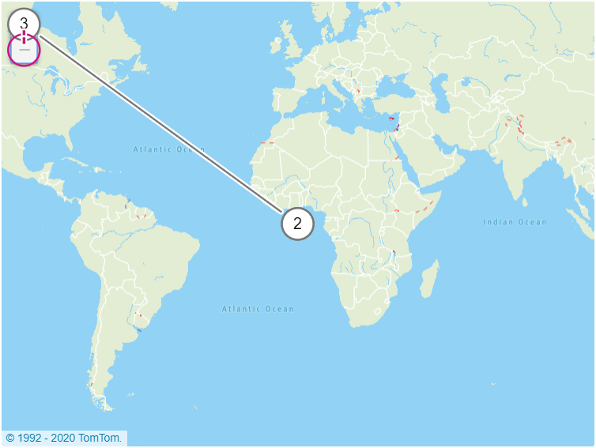</td>
      <td>
        

          
ChromeVox

          <ol>
            <li>"Map zoom in zoom out copyright 1992 to 2020 TomTom"</li>
            <li>"Map"</li>
            <li>"zoom in <i>button</i>"</li>
            <li>"zoom out <i>button</i>"</li>
          </ol>
        

        

          
NVDA

          <ol>
            <li>"<i>clickable</i> map <i>graphic</i> zoom in <i>button</i> zoom in zoom out <i>button</i> zoom out <i>clickable</i> copyright 1992 to 2020 TomTom"</li>
            <li><i>(no announcement)</i></li>
            <li>"Zoom in <i>button</i> zoom in"</li>
            <li>"Zoom out <i>button</i> zoom out"</li>
          </ol>
        

      </td>
    </tr>
  </tbody>
</table>

<h3><a href="https://www.w3.org/TR/WCAG21/#focus-visible">2.4.7 Focus Visible</a> (Level AA)</h3>

<h4>Assessment</h4>

<ol>
  <li>Sequentially navigate components using the <kbd>tab</kbd> key (and operate all controls).</li>
  <li>Check that script is not used to remove focus and that each component is highlighted.</li>
</ol>

If the requirements of step #2 is met <i>Result</i> is <i>Pass</i>, else <i>Fail</i>.

<table>
  <thead>
    <tr>
      <th scope="col">Web map tool</th>
      <th scope="col">Result</th>
      <th scope="col">Notes</th>
    </tr>
  </thead>
  <tbody>
    <tr>
      <th scope="row" align="left">Google Maps embed</th>
      <td>Fail</td>
      <td>2 tab stops without focus indicators.</td>
    </tr>
    <tr>
      <th scope="row" align="left">Google Maps Platform API</th>
      <td>Fail</td>
      <td>13 tab stops without focus indicators (in "Street view").</td>
    </tr>
    <tr>
      <th scope="row" align="left">Bing Maps embed</th>
      <td>Pass</td>
      <td></td>
    </tr>
    <tr>
      <th scope="row" align="left">Bing Maps Control API</th>
      <td>Pass</td>
      <td></td>
    </tr>
    <tr>
      <th scope="row" align="left">MapKit JS (Apple Maps) API</th>
      <td>Pass</td>
      <td></td>
    </tr>
    <tr>
      <th scope="row" align="left">Leaflet JS API</th>
      <td>Fail</td>
      <td>
        <ul>
          <li>1 tab stop without focus indicator.</li>
          <li>4 tab stops where focus indicators aren't persistently visible. [<a href="https://github.com/Leaflet/Leaflet/issues/6986">Github issue</a>]</li>
        </ul>
      </td>
    </tr>
    <tr>
      <th scope="row" align="left">OpenStreetMap embed</th>
      <td>Fail</td>
      <td>
        <ul>
          <li>1 tab stop without focus indicator.</li>
          <li>4 tab stops where focus indicators aren't persistently visible.</li>
        </ul>
      </td>
    </tr>
    <tr>
      <th scope="row" align="left">OpenLayers API</th>
      <td>Pass</td>
      <td></td>
    </tr>
    <tr>
      <th scope="row" align="left">MapBox Studio embed</th>
      <td>Fail</td>
      <td>1 tab stop without focus indicator. [<a href="https://github.com/mapbox/mapbox-gl-js/pull/9991">Github PR</a>]</td>
    </tr>
    <tr>
      <th scope="row" align="left">MapBox GL JS API</th>
      <td>Fail</td>
      <td>1 tab stop without focus indicator. [<a href="https://github.com/mapbox/mapbox-gl-js/pull/9991">Github PR</a>]</td>
    </tr>
    <tr>
      <th scope="row" align="left">TomTom Maps SDK for Web</th>
      <td>Fail</td>
      <td>2 tab stops without focus indicators.</td>
    </tr>
  </tbody>
</table>

<h3><a href="https://www.w3.org/TR/WCAG21/#target-size">2.5.5 Target Size</a> (Level AAA)</h3>

<h4>Assessment</h4>

<ol>
  <li>Identify <a href="https://www.w3.org/TR/WCAG21/#dfn-target">targets</a> for <a href="https://www.w3.org/TR/WCAG21/#dfn-pointer-inputs">pointer inputs</a>;</li>
  <li>
    Verify that the size of each target is at least 44 by 44 <a href="https://www.w3.org/TR/WCAG21/#dfn-css-pixels">CSS pixels</a> except when:
    <ul>
      <li>Equivalent: The target is available through an equivalent link or control on the same page that is at least 44 by 44 CSS pixels;</li>
      <li>Inline: The target is in a sentence or block of text;</li>
      <li>User Agent Control: The size of the target is determined by the user agent and is not modified by the author;</li>
      <li>Essential: A particular presentation of the target is essential to the information being conveyed.</li>
    </ul>
  </li>
</ol>

(Note: If you're a web map tool author wanting to conform to this SC, <a href="https://web.dev/tap-targets/">Lighthouse will flag targets that are smaller than 48 by 48</a> in CSS pixels as inappropriately sized.)

If requirements of check #2 is met <i>Result</i> is <i>Pass</i>, else <i>Fail</i>.

<table>
  <thead>
    <tr>
      <th scope="col">Web map tool</th>
      <th scope="col">Result</th>
      <th scope="col">Notes</th>
    </tr>
  </thead>
  <tbody>
    <tr>
      <th scope="row" align="left">Google Maps embed</th>
      <td>Fail</td>
      <td>4/4 targets are too small.</td>
    </tr>
    <tr>
      <th scope="row" align="left">Google Maps Platform API</th>
      <td>Fail</td>
      <td>14/14 targets are too small.</td>
    </tr>
    <tr>
      <th scope="row" align="left">Bing Maps embed</th>
      <td>Fail</td>
      <td>3/3 targets are too small.</td>
    </tr>
    <tr>
      <th scope="row" align="left">Bing Maps Control API</th>
      <td>Fail</td>
      <td>9/14 targets are too small.</td>
    </tr>
    <tr>
      <th scope="row" align="left">MapKit JS (Apple Maps) API</th>
      <td>Fail</td>
      <td>5/6 targets are too small.</td>
    </tr>
    <tr>
      <th scope="row" align="left">Leaflet JS API</th>
      <td>Fail</td>
      <td>2/2 targets are too small. [<a href="https://github.com/Leaflet/Leaflet/issues/7549">Github issue</a>]</td>
    </tr>
    <tr>
      <th scope="row" align="left">OpenStreetMap embed</th>
      <td>Fail</td>
      <td>2/2 targets are too small.</td>
    </tr>
    <tr>
      <th scope="row" align="left">OpenLayers API</th>
      <td>Fail</td>
      <td>2/2 targets are too small. [<a href="https://github.com/openlayers/openlayers/issues/12311">Github issue</a>]</td>
    </tr>
    <tr>
      <th scope="row" align="left">MapBox Studio embed</th>
      <td>Fail</td>
      <td>7/7 targets are too small.</td>
    </tr>
    <tr>
      <th scope="row" align="left">MapBox GL JS API</th>
      <td>Fail</td>
      <td>2/2 targets are too small.</td>
    </tr>
    <tr>
      <th scope="row" align="left">TomTom Maps SDK for Web</th>
      <td>Fail</td>
      <td>3/3 targets are too small.</td>
    </tr>
  </tbody>
</table>

<h3><a href="https://www.w3.org/TR/WCAG21/#language-of-page">3.1.1 Language of Page</a> (Level A)</h3>

  This Success Criterion is only applicable to <code>&lt;iframe&gt;</code> embedded web maps. Refer to the assessment of <a href="#312-language-of-parts-level-aa">SC 3.1.2 Language of Parts</a> for establishing whether a human language can
  be programmatically determined for non embedded web maps.

<h4>Assessment</h4>

<ol>
  <li>Check that the <code>lang</code> attribute is specified on the <code>&lt;html&gt;</code> element of the embedded document.</li>
  <li>Ensure that the language code matches that of the content (which may change due to language negotiation, based on system settings).</li>
</ol>

If both step #1 and #2 is true <i>Result</i> is <i>Pass</i>, else <i>Fail</i>.

<table>
  <thead>
    <tr>
      <th scope="col">Web map tool</th>
      <th scope="col">Result</th>
      <th scope="col">Notes</th>
    </tr>
  </thead>
  <tbody>
    <tr>
      <th scope="row" align="left">Google Maps embed</th>
      <td>Fail</td>
      <td></td>
    </tr>
    <tr>
      <th scope="row" align="left">Bing Maps embed</th>
      <td>Pass</td>
      <td>Specifies the corresponding <a href="https://en.wikipedia.org/wiki/ISO_639-1">ISO 639-1</a> code.</td>
    </tr>
    <tr>
      <th scope="row" align="left">OpenStreetMap embed</th>
      <td>Fail</td>
      <td></td>
    </tr>
    <tr>
      <th scope="row" align="left">MapBox Studio embed</th>
      <td>Pass</td>
      <td>Specifies the corresponding <a href="https://en.wikipedia.org/wiki/ISO_639-1">ISO 639-1</a> code.</td>
    </tr>
  </tbody>
</table>

<h3><a href="https://www.w3.org/TR/WCAG21/#language-of-parts">3.1.2 Language of Parts</a> (Level AA)</h3>

<h4>Assessment</h4>

<ol>
  <li>Check if the <code>lang</code> attribute is set, and the specified language code matches the language of the content (which may change due to language negotiation, based on system settings).</li>
</ol>

If step #1 is true <i>Result</i> is <i>Pass</i>, else <i>Fail</i>.

<table>
  <thead>
    <tr>
      <th scope="col">Web map tool</th>
      <th scope="col">Result</th>
      <th scope="col">Notes</th>
    </tr>
  </thead>
  <tbody>
    <tr>
      <th scope="row" align="left">Google Maps embed</th>
      <td>Fail</td>
      <td></td>
    </tr>
    <tr>
      <th scope="row" align="left">Google Maps Platform API</th>
      <td>Fail</td>
      <td></td>
    </tr>
    <tr>
      <th scope="row" align="left">Bing Maps embed</th>
      <td>Pass</td>
      <td>The language of Parts can be determined as the requirements of <a href="#311-language-of-page-level-a">SC 3.1.1 Language of Page</a> are met.</td>
    </tr>
    <tr>
      <th scope="row" align="left">Bing Maps Control API</th>
      <td>Fail</td>
      <td></td>
    </tr>
    <tr>
      <th scope="row" align="left">MapKit JS (Apple Maps) API</th>
      <td>Fail</td>
      <td></td>
    </tr>
    <tr>
      <th scope="row" align="left">Leaflet JS API</th>
      <td>Fail</td>
      <td></td>
    </tr>
    <tr>
      <th scope="row" align="left">OpenStreetMap embed</th>
      <td>Fail</td>
      <td></td>
    </tr>
    <tr>
      <th scope="row" align="left">OpenLayers API</th>
      <td>Fail</td>
      <td></td>
    </tr>
    <tr>
      <th scope="row" align="left">MapBox Studio embed</th>
      <td>Pass</td>
      <td>The language of Parts can be determined as the requirements of <a href="#311-language-of-page-level-a">SC 3.1.1 Language of Page</a> are met.</td>
    </tr>
    <tr>
      <th scope="row" align="left">MapBox GL JS API</th>
      <td>Fail</td>
      <td></td>
    </tr>
    <tr>
      <th scope="row" align="left">TomTom Maps SDK for Web</th>
      <td>Fail</td>
      <td></td>
    </tr>
  </tbody>
</table>

<h3><a href="https://www.w3.org/TR/WCAG21/#on-input">3.2.2 On Input</a> (Level A)</h3>
<h4>Assessment</h4>
<ol>
  <li>Change the setting of all components (e.g. pan and zoom the map display, change option in a drop-down menu, etc.).</li>
  <li>Verify that there is no automatic <a href="https://www.w3.org/TR/WCAG21/#dfn-change-of-context">change of context</a>.</li>
</ol>

If step #2 is true <i>Result</i> is <i>Pass</i>, else <i>Fail</i>.

<table>
  <thead>
    <tr>
      <th scope="col">Web map tool</th>
      <th scope="col">Result</th>
      <th scope="col">Notes</th>
      <th>Screen capture</th>
    </tr>
  </thead>
  <tbody>
    <tr>
      <th scope="row" align="left">Google Maps embed</th>
      <td>Pass</td>
      <td></td>
      <td></td>
    </tr>
    <tr>
      <th scope="row" align="left">Google Maps Platform API</th>
      <td>Fail</td>
      <td>
        Panning the map display using the arrow keys causes the document to scroll (in "Street view").
      </td>
      <td width="350"><a href="images/on-input/google-maps-api.gif">View autoplaying GIF</a></td>
    </tr>
    <tr>
      <th scope="row" align="left">Bing Maps embed</th>
      <td>Pass</td>
      <td></td>
      <td></td>
    </tr>
    <tr>
      <th scope="row" align="left">Bing Maps Control API</th>
      <td>Pass</td>
      <td></td>
      <td></td>
    </tr>
    <tr>
      <th scope="row" align="left">MapKit JS (Apple Maps) API</th>
      <td>Pass</td>
      <td></td>
      <td></td>
    </tr>
    <tr>
      <th scope="row" align="left">Leaflet JS API</th>
      <td>Pass</td>
      <td></td>
      <td></td>
    </tr>
    <tr>
      <th scope="row" align="left">OpenStreetMap embed</th>
      <td>Pass</td>
      <td></td>
      <td></td>
    </tr>
    <tr>
      <th scope="row" align="left">OpenLayers API</th>
      <td>Pass</td>
      <td></td>
      <td></td>
    </tr>
    <tr>
      <th scope="row" align="left">MapBox Studio embed</th>
      <td>Pass</td>
      <td></td>
      <td></td>
    </tr>
    <tr>
      <th scope="row" align="left">MapBox GL JS API</th>
      <td>Pass</td>
      <td></td>
      <td></td>
    </tr>
    <tr>
      <th scope="row" align="left">TomTom Maps SDK for Web</th>
      <td>Fail</td>
      <td>
        Panning the map display using the arrow keys causes the document to scroll.
      </td>
      <td width="350"><a href="images/on-input/tomtom-maps-sdk-api.gif">View autoplaying GIF</a></td>
    </tr>
  </tbody>
</table>

<h3><a href="https://www.w3.org/TR/WCAG21/#change-on-request">3.2.5 Change on Request</a> (Level AAA)</h3>

<h4>Assessment</h4>
<ol>
  <li>Verify that <a href="https://www.w3.org/TR/WCAG21/#dfn-change-of-context">Changes of context</a> are initiated only by user request or a <a href="https://www.w3.org/TR/WCAG21/#dfn-mechanism">mechanism</a> is available to turn off such changes.
</ol>

If requirements of step #1 is met <i>Result</i> is <i>Pass</i>, else <i>Fail</i>.

<table>
  <thead>
    <tr>
      <th scope="col">Web map tool</th>
      <th scope="col">Result</th>
      <th scope="col">Notes</th>
    </tr>
  </thead>
  <tbody>
    <tr>
      <th scope="row" align="left">Google Maps embed</th>
      <td>Fail</td>
      <td>
        Both the "View larger map" link and the "Terms of Use" link open in new windows without warning. The "View larger map" link is especially unexpected as stylistically, it resembles a button, not a link.
      </td>
    </tr>
    <tr>
      <th scope="row" align="left">Google Maps Platform API</th>
      <td>Fail</td>
      <td>
        The "Terms of Use" link opens in new window without warning. The Google logo link contains the screen reader label "Open this area in Google Maps", which does give the user sufficient warning, as it may open in the native Maps app on mobile.
      </td>
    </tr>
    <tr>
      <th scope="row" align="left">Bing Maps embed</th>
      <td>Fail</td>
      <td>
        Both the Bing Maps logo and the "Terms" link open in new windows without warning.
      </td>
    </tr>
    <tr>
      <th scope="row" align="left">Bing Maps Control API</th>
      <td>Fail</td>
      <td>
        Both the Bing Maps logo and the "Terms" link open in new windows without warning.
      </td>
    </tr>
    <tr>
      <th scope="row" align="left">MapKit JS (Apple Maps) API</th>
      <td>Fail</td>
      <td>
        The "Legal" link is incorrectly marked up as a button (<code>role="button"</code>), opens in new tab without warning.
      </td>
    </tr>
    <tr>
      <th scope="row" align="left">Leaflet JS API</th>
      <td>Pass</td>
      <td></td>
    </tr>
    <tr>
      <th scope="row" align="left">OpenStreetMap embed</th>
      <td>Fail</td>
      <td>
        The "Report a problem" and "OpenStreetMap" links open in a new tab without warning.
      </td>
    </tr>
    <tr>
      <th scope="row" align="left">OpenLayers API</th>
      <td>Fail</td>
      <td>
        The "OpenStreetMap" link opens in a new tab without warning.
      </td>
    </tr>
    <tr>
      <th scope="row" align="left">MapBox Studio embed</th>
      <td>Fail</td>
      <td>
        Mapbox logo link opens in a new tab without warning.
      </td>
    </tr>
    <tr>
      <th scope="row" align="left">MapBox GL JS API</th>
      <td>Fail</td>
      <td>
        Mapbox logo link opens in a new tab without warning.
      </td>
    </tr>
    <tr>
      <th scope="row" align="left">TomTom Maps SDK for Web</th>
      <td>Pass</td>
      <td></td>
    </tr>
  </tbody>
</table>

<h3><a href="https://www.w3.org/TR/WCAG21/#name-role-value">4.1.2 Name, Role, Value</a> (Level A)</h3>

<h4>Assessment</h4>

For all <a href="https://www.w3.org/TR/WCAG21/#dfn-user-interface-components">user interface components</a>:

<ol>
  <li>
    The <a href="https://www.w3.org/TR/WCAG21/#dfn-name">name</a> and <a href="https://www.w3.org/TR/WCAG21/#dfn-role">role</a> can be
    <a href="https://www.w3.org/TR/WCAG21/#dfn-programmatically-determinable">programmatically determined</a>;
  </li>
  <li>states, properties, and values that can be set by the user can be <a href="https://www.w3.org/TR/WCAG21/#dfn-programmatically-set">programmatically set</a>;</li>
  <li>and notification of changes to these items is available to user agents, including assistive technologies.</li>
</ol>

If the requirements of all the above checks are met, <i>Result</i> is <i>Pass</i>, else <i>Fail</i>.

<table>
  <thead>
    <tr>
      <th scope="col">Web map tool</th>
      <th scope="col">Result</th>
      <th scope="col">Notes</th>
    </tr>
  </thead>
  <tbody>
    <tr>
      <th scope="row" align="left">Google Maps embed</th>
      <td>Fail</td>
      <td>
        <ul>
          <li>The "map component" (<code>&lt;div tabindex="0"&gt;</code>, which acts as a control to zoom the map display) is missing <i>name</i> and <i>role</i>.</li>
          <li>Control to toggle between "Satellite imagery" and "Street map" is missing <i>name</i> and <i>role</i>.</li>
        </ul>
      </td>
    </tr>
    <tr>
      <th scope="row" align="left">Google Maps Platform API</th>
      <td>Fail</td>
      <td>
        <ul>
          <li>The "map component" (<code>&lt;div tabindex="0"&gt;</code>, which acts as control to both zoom and pan the map display) is missing <i>name</i> and <i>role</i>.</li>
          <li>Control to exit "Street view" (<code>&lt;div jsaction="closeControl.click"&gt;</code>) is missing <i>name</i> and <i>role</i>.</li>
          <li>Control to reset the bearing (in "Street view") is missing <i>name</i>.</li>
          <li>Control to rotate the bearing counter-clockwise (in "Street view") is missing <i>name</i>.</li>
          <li>Control to rotate the bearing clockwise (in "Street view") is missing <i>name</i>.</li>
        </ul>
      </td>
    </tr>
    <tr>
      <th scope="row" align="left">Bing Maps embed</th>
      <td>Fail</td>
      <td>The "map component" (<code>&lt;div tabindex="0"&gt;</code>, which acts as a control to both zoom and pan the map display) is missing <i>role</i>.</td>
    </tr>
    <tr>
      <th scope="row" align="left">Bing Maps Control API</th>
      <td>Fail</td>
      <td>
        <ul>
          <li>The "map component" (<code>&lt;div tabindex="0"&gt;</code>, which acts as a control to both zoom and pan the map display) is missing <i>role</i>.</li>
          <li>Control to toggle area labels under "Bird's Eye view" is missing <i>name</i>.</li>
        </ul>
      </td>
    </tr>
    <tr>
      <th scope="row" align="left">MapKit JS (Apple Maps) API</th>
      <td>Fail</td>
      <td>
        Control to rotate/reset the bearing is missing <i>role</i>. (Note: there are two separate controls providing the same functionality, for clarification, this refers to <code>&lt;div tabindex="0"&gt;</code> and not the
        <code>&lt;input type="range" aria-label="{x} degrees"&gt;</code> control.)
      </td>
    </tr>
    <tr>
      <th scope="row" align="left">Leaflet JS API</th>
      <td>Fail</td>
      <td>
        The "map component" (<code>&lt;div tabindex="0"&gt;</code>, which acts as a control to both zoom and pan the map display) is missing <i>name</i> and <i>role</i>. 
        [<a href="https://github.com/Leaflet/Leaflet/issues/7193">Github issue</a>]
      </td>
    </tr>
    <tr>
      <th scope="row" align="left">OpenStreetMap embed</th>
      <td>Fail</td>
      <td>The "map component" (<code>&lt;div tabindex="0"&gt;</code>, which acts as a control to both zoom and pan the map display) is missing <i>name</i> and <i>role</i>.</td>
    </tr>
    <tr>
      <th scope="row" align="left">OpenLayers API</th>
      <td>Fail</td>
      <td>
        Controls to zoom in and zoom out do not have proper <i>name</i>s (while the <code>title</code>s "Zoom in" and "Zoom out" are appropriate, the child text nodes "+" and "−" takes precedence in this case, according to the
        <a href="https://www.w3.org/TR/accname-1.1/#mapping_additional_nd_te">accessible name and description computation</a>, and is announced as "button plus" and "button minus" in ChromeVox, for example).
        [<a href="https://github.com/openlayers/openlayers/issues/12041">Github issue</a>]
      </td>
    </tr>
    <tr>
      <th scope="row" align="left">MapBox Studio embed</th>
      <td>Fail</td>
      <td>
        <ul>
          <li>The "map component" (<code>&lt;canvas tabindex="0"&gt;</code>, which acts as a control to both zoom and pan the map display) is missing <i>role</i>. [<a href="https://github.com/mapbox/mapbox-gl-js/pull/9991">Github PR</a>]</li>
          <li>Control to display attribution and feedback links is missing <i>name</i> and <i>role</i>. [<a href="https://github.com/mapbox/mapbox-gl-js/pull/9991">Github PR</a>]</li>
        </ul>
      </td>
    </tr>
    <tr>
      <th scope="row" align="left">MapBox GL JS API</th>
      <td>Fail</td>
      <td>
        <ul>
          <li>The "map component" (<code>&lt;canvas tabindex="0"&gt;</code>, which acts as a control to both zoom and pan the map display) is missing <i>role</i>. [<a href="https://github.com/mapbox/mapbox-gl-js/pull/9991">Github PR</a>]</li>
          <li>Control to display attribution and feedback links is missing <i>name</i> and <i>role</i>. [<a href="https://github.com/mapbox/mapbox-gl-js/pull/9991">Github PR</a>]</li>
        </ul>
      </td>
    </tr>
    <tr>
      <th scope="row" align="left">TomTom Maps SDK for Web</th>
      <td>Fail</td>
      <td>
        <ul>
          <li>The "map component" (<code>&lt;div tabindex="0"&gt;</code>, which acts as a control to both zoom and pan the map display) is missing <i>name</i> and <i>role</i>.</li>
          <li>Control to open the copyright message dialog is missing <i>role</i>.</li>
          <li>Control to close the copyright message dialog is missing <i>name</i> and <i>role</i>.</li>
        </ul>
      </td>
    </tr>
  </tbody>
</table>

<h2>Other substantial accessibility issues</h2>

<ul>
  <li>Maps' content is almost never programmatically determinable and thus not available to users of assistive technology.</li>
  <li>
    Most controls (commonly <code>&lt;a role="button"&gt;</code>) do not activate on both <kbd>enter</kbd> and <kbd>space</kbd> key presses (see WAI-ARIA Authoring Practices's recommended
    <a href="https://www.w3.org/TR/wai-aria-practices/#keyboard-interaction-3">Keyboard Interactions</a> for buttons).
  </li>
  <li>Majority of web maps don't present a fullscreen button by default.</li>
  <li>Not all web map container elements are focusable (<em>and</em> enclose all their components); tabbing to the web map's components does not guarantee the map display to be fully in the user's viewport.</li>
  <li>There's no way to pan the map displays using a single pointer gesture.</li>
  <li>Available keyboard shortcuts are not conveyed to the user.</li>
  <li>All web maps fail to display each discrete element (country boundaries, bodies of water, roads etc.) in sharp contrast to each other (SC <a href="https://www.w3.org/TR/WCAG21/#non-text-contrast">1.4.11 Non-text Contrast</a>), and none of the web maps support high contrast mode.</li>
</ul>

<h2>Issue reporting</h2>

This document may include links to existing Github issues/PRs pertaining to a particular failure of a Success Criterion, however, it will not be updated to reflect any such fixes.

Additionally, this evaluation was reported to the web map tools' authors for awareness:

<ul>
  <li>Google Maps:  <a href="https://issuetracker.google.com/issues/69541792#comment37">https://issuetracker.google.com/issues/69541792#comment37</a></li>
  <li>Bing Maps: <a href="https://social.msdn.microsoft.com/Forums/en-US/48cac514-03ba-49d7-a91b-de9a066bb5d8/accessibility-evaluation-wcag-21?forum=bingmaps">https://social.msdn.microsoft.com/Forums/en-US/48cac514-03ba-49d7-a91b-de9a066bb5d8/accessibility-evaluation-wcag-21?forum=bingmaps</a></li>
  <li>MapKit JS (Apple Maps): <a href="https://developer.apple.com/forums/thread/674971">https://developer.apple.com/forums/thread/674971</a>
    <ul>
      <li>DuckDuckGo Maps: <a href="https://github.com/duckduckgo/community-platform/issues/1531">https://github.com/duckduckgo/community-platform/issues/1531</a></li>
    </ul>
  </li>
  <li>OpenLayers: <a href="https://github.com/openlayers/openlayers/issues/11678">https://github.com/openlayers/openlayers/issues/11678</a></li>
  <li>OpenStreetMap: <a href="https://lists.openstreetmap.org/pipermail/accessibility/2020-October/000421.html">https://lists.openstreetmap.org/pipermail/accessibility/2020-October/000421.html</a></li>
	<li>MapBox: <a href="https://github.com/mapbox/mapbox-gl-js/pull/9991">https://github.com/mapbox/mapbox-gl-js/pull/9991</a>
    <ul>
      <li>MapLibre: <a href="https://github.com/maplibre/maplibre-gl-js/issues/53">https://github.com/maplibre/maplibre-gl-js/issues/53</a></li>
    </ul>
  </li>
  <li>TomTom Maps: <a href="https://devforum.tomtom.com/t/accessibility-evaluation-wcag-2-1/1400">https://devforum.tomtom.com/t/accessibility-evaluation-wcag-2-1/1400</a></li>
</ul>
